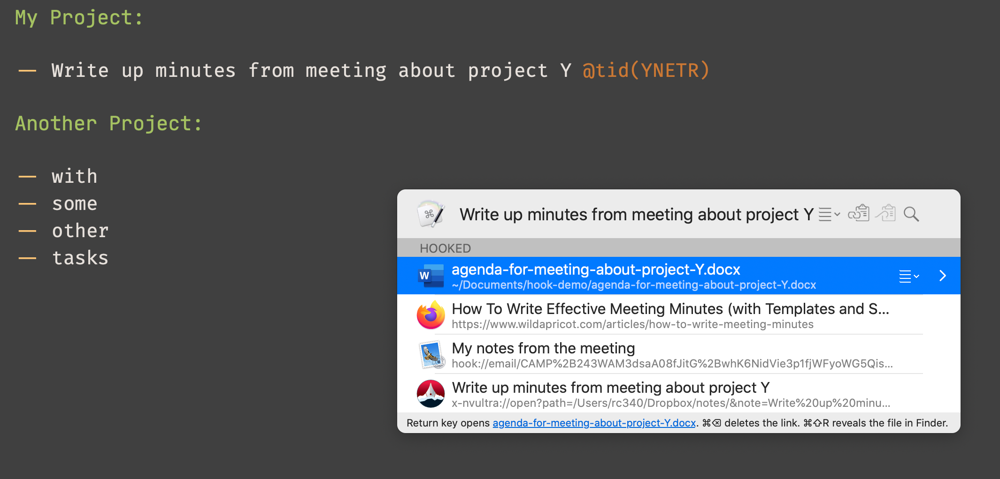

# TaskPaper Hook 

[Hook](https://hookproductivity.com/) allows you to link "items of content" on your Mac so that you can quickly hop between them using a LaunchPad / Alfred type interface. For instance you can link a file with an email with a website. These scripts allow you to link these things to an individual [TaskPaper](https://www.taskpaper.com/) task. You can jump directly to any of these, or create a new (for example) [nvUltra](https://nvultra.com/) document for this task.

## Caveats

1. It requires [Keyboard Maestro](https://www.keyboardmaestro.com/main/)
2. It requires you to add an id tag to a task (e.g. `@tid(Mi3yS)`). There is a Keyboard Maestro macro that will generate these for you.

## Installation

1. Copy the text from [hook_tp_script.scpt](hook_tp_script.scpt) into the "Get Address" section of a new TaskPaper script in Hook ([more information here](https://hookproductivity.com/help/integration/creating-integration-scripts/)).
2. Import the [tp_km_macros.kmmacros](tp_km_macros.kmmacros) macros into Keyboard Maestro. **Don't** restrict the TaskPaper macros to only run in TaskPaper, or else they can't be run by Hook.

## Usage

1. For a task you want hook to, add an id using the format `@tid(xxxxx)` where xxxxx is a string of letters and numbers that are unique to that task. You can generate this by entering `;id` to trigger one of the Keyboard Maestro macros
2. Trigger hook while the cursor is on the line of the task to open hooks to that task, or to copy a hook to that task to link to another.
3. Use the "Create New" feature of Hook to link a task to a new text file (e.g. in nvUltra) to store and retrieve unlimited notes about a task.
4. Projects and notes can be hooked to in the same way.

## Implementation notes

1. The Hook script runs a KM macro which looks for the id using a RegEx. If found it passes the ID and task name back to the Hook script.
2. If there is no id for the task a hook to the document is created.
3. When linking _to_ a task, a URL is created using the the scheme `kmtrigger://macro=tp3_open_taskpaper_task_url&value=<id>`. Opening this link will call the macro `tp3_open_taskpaper_task_url` passing in the task ID. This uses the TaskPaper API to find the task and focus on it.

## Possible Improvements

1. It's possible this can be done without Keyboard Maestro. 
   1. The Hook "Get Address" script could extract the Id and text directly without calling KM.
   2. A `kmtrigger` is unnecessary if the "Open Item" script for TaskPaper is implemented with a new scheme (e.g. `TaskPaper://`). That would require Applescript to do the same thing as the `tp3_open_taskpaper_task_url` KM Macro.
2. If there is no `@tid` tag on a task when Hook is opened, Hook could add it first before hooking.

